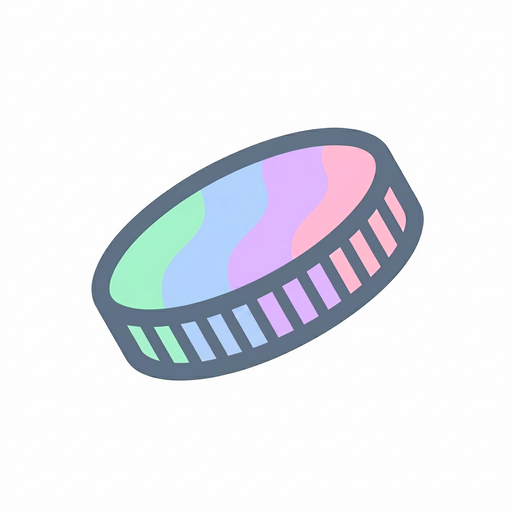

<div align="center">

  

  # **CAMBI**
  ### Tasa Oficial BCV, Calculadora & Gestor de Pago Móvil

  <p align="center">
    Una Progressive Web App (PWA) moderna, fluida y minimalista diseñada con estética <b>Material You (M3)</b> para consultar la tasa oficial de cambio en Venezuela (USD y EUR), realizar conversiones con calculadora aritmética integrada en tiempo real y gestionar cobros con <b>Pago Móvil y código QR sin conexión</b>.
  </p>

  <p align="center">
    <a href="https://cambibak.rf.gd/" target="_blank" rel="noopener noreferrer">
      
    </a>
    
    
    
    
  </p>

  <p align="center">
    🔗 <b>Sitio Web Público:</b> <a href="https://cambibak.rf.gd/" target="_blank"><b>https://cambibak.rf.gd/</b></a>
  </p>

</div>

---

## 🎨 Paleta de Color y Diseño

Cambi utiliza una paleta cromática pastel contemporánea inspirada en las especificaciones de diseño dinámico **Material Design 3 (Material You)**:

| Muestra | Nombre | Hexadecimal | Uso en la Aplicación |
| :---: | :--- | :---: | :--- |
| `🟢` | **Magic Mint** | `#A3F1CB` | Tasa USD, botones de acción primaria (`=`), cursor personalizado |
| `🔵` | **Baby Blue** | `#B1D3FE` | Tasa EUR, acentos secundarios, indicadores de estado |
| `🟣` | **Mauve** | `#DFB8FF` | Teclas de operadores matemáticos (`/`, `x`, `-`, `+`) |
| `🌸` | **Cotton Candy** | `#FFB7D3` | Botón de reinicio / borrar (`C`), alertas y acentos cálidos |
| `⚙️` | **Dark Electric** | `#617285` | Marca institucional, modo oscuro (`#20252B`), sombras y bordes |
| `☁️` | **Surface Light** | `#FEF7FF` | Superficie y fondo principal en modo claro |
| `🌙` | **Surface Dark** | `#20252B` | Superficie y fondo principal en modo oscuro |

---

## ✨ Características Principales

- 🏛️ **Tasas Oficiales al Día:** Consulta directa con el portal del Banco Central de Venezuela (BCV) para obtener cotizaciones oficiales de **USD** y **EUR**.
- 🧮 **Calculadora Aritmética Dinámica:**
  - Permite ingresar fórmulas completas como `50 + 20 - 5 * 2`.
  - Desglose y previsualización de subtotal en tiempo real encima del input.
  - Conversión automática e instantánea al valor equivalente en Bolívares o Dólares.
- 💳 **Gestor de Pago Móvil (Local-First):**
  - **Tour Interactivo:** Carrusel de bienvenida para nuevos usuarios explicando las ventajas del módulo.
  - **Arquitectura Local-First:** Tus datos bancarios se guardan exclusivamente en tu dispositivo (`localStorage`), garantizando máxima privacidad, cero consumo de servidor y funcionamiento 100% offline.
  - **Soporte Multibanco:** Cédula y teléfono unificados; salta entre múltiples bancos (Banesco, Venezuela, Mercantil, Bancamiga, etc.) con un solo toque.
  - **Copia Inmediata:** Copia los datos al portapapeles con formato limpio listo para enviar por WhatsApp.
  - **Generador de QR Offline:** Genera al instante el código QR para que cualquier cliente lo escanee sin necesidad de conexión.
- 🔀 **Conversión Bidireccional:** Alterna el sentido del cambio (USD &rarr; VES o VES &rarr; USD) con un solo toque y rotación fluida de 180°.
- 👆 **Control Táctil de Precisión:**
  - Cursor interactivo flotante (*custom pulsing caret*) calibrado milimétricamente.
  - Permite tocar cualquier dígito u operador directamente para reposicionar el cursor.
  - Soporte de flechas físicas (`←` `→`), atajos de teclado y `Backspace` en navegadores de escritorio.
- 📜 **Historial de Variación:** Consulta las últimas tasas registradas para comparar fluctuaciones cambiarias.
- 🌓 **Modo Oscuro Adaptativo:** Detección de preferencias del sistema y selector persistente con sincronización de la barra de estado móvil (`meta theme-color`).
- 📶 **PWA & Modo Offline:** Instalable en iOS y Android con *Service Worker* y almacenamiento en caché para funcionar con conexiones inestables.
- 🚀 **Cero Dependencias Pesadas:** Construido enteramente con PHP nativo y Vanilla JavaScript (sin frameworks externos voluminosos).

---

## 🛠️ Tecnologías

- **Backend:** PHP 8.x (API REST ligera, scraper con fallback, cache local JSON, cron background worker).
- **Frontend:** Vanilla JavaScript (ES6+), CSS3 con variables nativas, animaciones Cubic-Bezier y Material Symbols.
- **PWA:** Web App Manifest, Service Worker y Splash Screen interactivo.
- **Entorno de Desarrollo:** [DDEV](https://ddev.com/) (Nginx, PHP 8.4, HTTPS local).

---

## 📂 Estructura del Proyecto

```text
cambi/
├── api.php              # Endpoint API REST con sistema de caché y fallback
├── cron.php             # Worker en segundo plano para sincronizar tasas BCV
├── cache.json           # Caché local de tasas activas
├── history.json         # Historial acumulado de cotizaciones
├── index.php            # Vista principal y orquestador de componentes
├── head.php             # Metadatos, fuentes tipográficas y hoja de estilos global
├── header.php           # Barra superior con branding y acceso a ajustes
├── rates_tab.php        # Pestaña de cotizaciones oficiales USD / EUR
├── pagomovil_tab.php    # Pestaña de gestión de Pago Móvil, selector bancario y QR
├── calculator_tab.php   # Pestaña de calculadora interactiva y teclado numérico
├── history_tab.php      # Pestaña de historial cambiario
├── bottom_nav.php       # Barra de navegación inferior estilo M3
├── scripts.php          # Lógica frontend: cálculos, cursor, Pago Móvil, temas y eventos
├── sw.js                # Service Worker para capacidades PWA y offline
├── manifest.json        # Configuración PWA para instalación móvil
└── public/              # Favicons, iconos PWA, qrcode.min.js e imágenes del branding
```

---

## 🚀 Instalación y Puesta en Marcha

### Acceso Directo (Demo en Producción)

Puedes usar la versión pública directamente sin instalar nada:
👉 **[https://cambibak.rf.gd/](https://cambibak.rf.gd/)**

---

### Con DDEV (Recomendado para Desarrollo Local)

1. Clona el repositorio:
   ```bash
   git clone https://github.com/fernandorodriguezrada/cambi.git
   cd cambi
   ```

2. Inicia el entorno:
   ```bash
   ddev start
   ```

3. Abre el proyecto en tu navegador:
   ```bash
   ddev launch
   ```

### Con el Servidor Integrado de PHP

Si no utilizas DDEV, puedes ejecutarlo localmente con el CLI de PHP:

```bash
php -S localhost:8000
```
Luego visita `http://localhost:8000` en tu navegador.

---

## 🌿 Flujo de Ramas

Este repositorio mantiene una estructura de dos ramas principales:

- **`main`**: Rama de producción y versiones estables listas para despliegue.
- **`dev`**: Rama activa de desarrollo e integración continua para nuevas características y pruebas.

---

<div align="center">
  <sub>Desarrollado con dedicación por <b>Fernando Rodríguez</b> 🇻🇪</sub>
</div>
